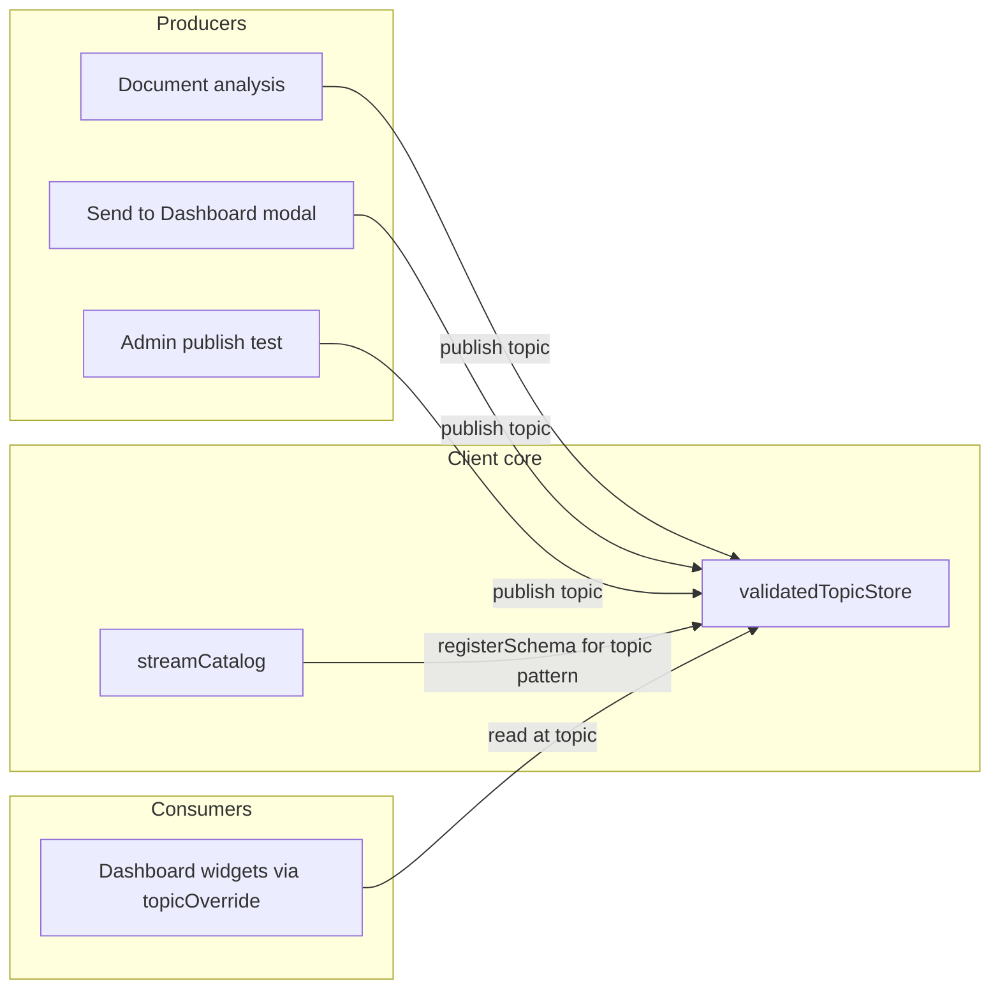

# AI Streams (Data Streams)

This document describes **AI Streams** in the `uw-webapp`: how structured AI output is routed to dashboard widgets through named **topics** and **JSON Schemas**. It is aimed at developers and power users who need the full picture; end-user copy in the app may say “AI stream” or “Data Stream” interchangeably.

---

## What it is

An **AI Stream** (internally a **Data Stream**) is a **catalog entry** that ties together:

| Field | Role |
| ----- | ---- |
| **Topic** | A slash-separated path (same style as `ValidatedTopicStore` topics). Published payloads are written to this path. |
| **Schema ID** | References a registered schema in `ValidatedTopicStore`. Incoming data is validated before it is stored on the topic. |
| **Title / description** | Human-readable labels in pickers and the Store Inspector. |
| **Optional `promptId` / `promptName`** | Associates the stream with a Prompt so document analysis can auto-select or auto-publish to the right stream. |

Widgets subscribe by setting a **`topicOverride`** to the stream’s topic. They then read live data from `ValidatedTopicStore` at that path, like any other topic-backed widget.

So: **AI Stream = metadata + validation binding + topic path**, not a network socket. Payloads arrive when something calls `validatedTopicStore.publish(stream.topic, value)` (after a successful AI run or a manual test publish).

---

## What it is not (disambiguation)

- **OpenAI “stream” flag** on prompts (`aiQueryData.stream` in the Prompt Library / workflow editors) means **token streaming** from the chat API. That is separate from the **Data Stream** catalog described here.
- **AI Streams** do not replace AppSync or server persistence. Today they are **browser-local**: catalog in `localStorage`, data in `ValidatedTopicStore` memory (with that store’s own sync story; see [ValidatedTopicStore and browser sync](./validated-topic-store-browser-sync.md)).

---

## Architecture

1. **`streamCatalog`** (`src/lib/stores/streamCatalog.svelte.ts`) holds the list of streams and persists it under the `stream-catalog` `localStorage` key.
2. On **add/update**, each stream registers a **topic pattern** in `ValidatedTopicStore` (cloned registration with `id: stream:{streamId}`) so publishes to `stream.topic` are validated against the stream’s schema.
3. **Widgets** use **`topicOverride`** to listen on that topic; `WidgetWrapper` treats a matching `streamCatalog.getStreamByTopic(currentTopic)` as “Connected to AI stream”.

---

## Lifecycle and persistence

- **Init / destroy**: `src/routes/+layout.svelte` calls `streamCatalog.init()` on mount and `streamCatalog.destroy()` on teardown so the catalog loads from storage and subscribes to cross-tab updates.
- **Cross-tab sync**: `BroadcastChannel('stream-catalog-sync')` replicates add/remove/update across browser tabs.
- **Deleting a stream** does not remove widget `topicOverride` values (see `StreamsPanel` copy). Widgets may still point at the old topic until reconfigured.

---

## End-user and operator flows

### 1. Connect a widget to a stream

1. Open the widget **Configure** dialog (`WidgetWrapper`).
2. Under **Data Source**, open the **AI Streams** tab.
3. Pick a stream in **`StreamPicker`** (filtered by **schema compatibility** with the widget’s expected schema when possible).
4. Applying the change sets **`topicOverride`** to the stream’s topic (via `handleStreamSelect` → `applyTopicChange`).

Compatible stream rows show how well the stream’s schema matches the widget schema (`checkSchemaCompatibility` in `src/lib/utils/schemaCompatibility.ts`).

### 2. Document analysis → dashboard

- **Send to Dashboard** (`SendToDashboardModal`): three steps — choose or create a stream, optionally add compatible widgets, then **Publish** (validates with `validatedTopicStore.publish` and updates all subscribers).
- **Auto-publish**: when an AI query completes successfully, if a stream exists with **`promptId`** equal to the prompt, structured output is **published automatically** to `stream.topic` (`document-analysis/+page.svelte`).

Creating a stream from this flow **prefills** topic (`ai/doc-analysis/{promptId prefix}`), title, prompt linkage, and attempts to match **`schemaId`** from the prompt’s `outputSchema` against known UI schemas.

### 3. Prompt ↔ stream binding

- Streams created from a prompt run set **`source: 'prompt'`** and **`promptId`** / **`promptName`** in `StreamCreateModal`.
- **`streamCatalog.getStreamByPromptId`** is used to pre-select or auto-publish for that prompt.

### 4. Store Inspector (admin)

**Admin → Store** includes a **Streams** tab (`StreamsPanel`):

- Lists all streams with schema names and **consumers** (dashboard widgets whose `topicOverride` equals the stream topic).
- Edit/delete streams, open **publish test** (JSON body → `validatedTopicStore.publish` for quick validation checks).

**Schema Explorer** shows how many streams reference each schema (`getStreamsBySchemaId`).

---

## Data model (`DataStream`)

Defined in `streamCatalog.svelte.ts`:

- `id`: UUID (internal).
- `topic`: unique path used for publish/subscribe.
- `schemaId`: must exist in `ValidatedTopicStore`’s schema registry.
- `title`, optional `description`.
- Optional `promptId`, `promptName`.
- `source`: `'prompt' | 'manual' | 'code'` (reserved for provenance; `'code'` is available for future programmatic registration).
- `createdAt`, `updatedAt` (ISO strings).

---

## Developer API (`streamCatalog`)

| Method | Purpose |
| ------ | ------- |
| `init()` / `destroy()` | Load persisted streams, register schemas, attach `BroadcastChannel`. |
| `addStream(params)` | Append stream, register topic schema, persist, broadcast. |
| `updateStream(id, partial)` | Merge fields, re-register, persist, broadcast. |
| `removeStream(id)` | Remove from catalog and storage (does not clear topic data in `ValidatedTopicStore`). |
| `getStream` / `getStreamByTopic` / `getStreamByPromptId` | Lookups. |
| `getStreamsBySchemaId` / `getStreamsForPrompt` | Admin and schema views. |

---

## Key source files

| Area | Path |
| ---- | ---- |
| Catalog store | `src/lib/stores/streamCatalog.svelte.ts` |
| Pick / create UI | `src/lib/components/streams/StreamPicker.svelte`, `StreamCreateModal.svelte` |
| Widget wiring | `src/lib/dashboard/components/WidgetWrapper.svelte` |
| Send to dashboard | `src/routes/projects/workspace/[projectId]/document-analysis/components/SendToDashboardModal.svelte` |
| Auto-publish on query | `src/routes/projects/workspace/[projectId]/document-analysis/+page.svelte` |
| Admin streams tab | `src/routes/admin/store/StreamsPanel.svelte` |
| Root init | `src/routes/+layout.svelte` |

---

## Related documentation

- [ValidatedTopicStore, schema registration, and browser sync](./validated-topic-store-browser-sync.md) — how `publish`, patterns, and validation behave.
- Dashboard widget system: `src/lib/dashboard/docs/README.md` and `ARCHITECTURE_OVERVIEW.md` for topics, persistence, and widget data flow.
