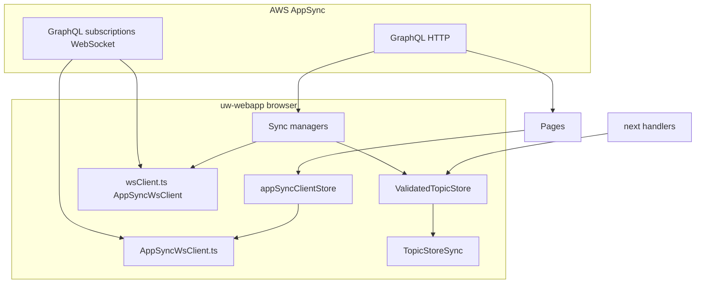

# AppSync realtime WebSocket and ValidatedTopicStore

This is the **canonical** documentation for:

1. **`AppSyncWsClient`** — browser WebSocket client(s) for AWS AppSync GraphQL subscriptions.
2. **`appSyncClientStore`** — singleton wrapper used by most pages and components.
3. **How realtime connects to `ValidatedTopicStore`** — the validated in-memory topic tree used by the dashboard and widgets.

For the full **ValidatedTopicStore** API (publish, schemas, hooks, TopicStoreSync, stream catalog), see [validated-topic-store.md](./validated-topic-store.md).

---

## Table of contents

1. [Architecture overview](#1-architecture-overview)
2. [AppSync WebSocket protocol in this repo](#2-appsync-websocket-protocol-in-this-repo)
3. [Two `AppSyncWsClient` implementations](#3-two-appsyncwsclient-implementations)
4. [Type definitions (`types.ts`)](#4-type-definitions-typests)
5. [`appSyncClientStore` (recommended entry point)](#5-appsyncclientstore-recommended-entry-point)
6. [`AppSyncWsClient` class reference](#6-appsyncwsclient-class-reference)
7. [`wsClient.ts` singleton (`getAppSyncWsClient` / `initAppSyncWsClient`)](#7-wsclients-ts-singleton)
8. [Bridging subscriptions to ValidatedTopicStore](#8-bridging-subscriptions-to-validatedtopicstore)
9. [Ontology Graph subscriptions](#9-ontology-graph-subscriptions)
10. [File index](#10-file-index)

---

## 1. Architecture overview



- **HTTP** — Queries and mutations (e.g. `GraphQLQueryClient`, fetch).
- **WebSocket** — Subscriptions only; one logical connection per browser session is ideal.
- **`ValidatedTopicStore`** is **not** a WebSocket client. It is an in-memory, schema-validated tree. Realtime handlers call `validatedTopicStore.publish(topic, value)` after receiving subscription payloads.

---

## 2. AppSync WebSocket protocol in this repo

- **Subprotocol:** `graphql-ws` (AppSync’s WebSocket API).
- **Auth:** Cognito **ID token** in the WebSocket handshake via a base64-encoded `header-…` subprotocol payload containing `{ host, Authorization }` (or API key mode: `{ host, 'x-api-key' }`).
- **HTTP URL → realtime URL:** `graphqlHttpUrl` (e.g. `https://…appsync-api…/graphql`) is converted to `wss://…appsync-realtime-api…/graphql` by `toRealtimeUrl()` in `utils.ts`.
- **Lifecycle:** `connection_init` → `connection_ack` → per-subscription `start` with `payload.data` = stringified GraphQL document + variables, and `extensions.authorization` for AppSync. Server sends `ka` (keep-alive), `data`, `error`, `complete`.
- **Environment:** Clients **must run in the browser** (`typeof window !== 'undefined'`); constructors throw during SSR.

---

## 3. Two `AppSyncWsClient` implementations

| Aspect | [`AppSyncWsClient.ts`](../src/lib/services/realtime/websocket/AppSyncWsClient.ts) | [`wsClient.ts`](../src/lib/services/realtime/websocket/wsClient.ts) |
|--------|----------------------------------------------------------------------------------|---------------------------------------------------------------------|
| **Role** | Default client used by **`appSyncClientStore`** | “Hardened” variant used by **sync managers** |
| **Singleton** | Created by `appSyncClientStore` only | `initAppSyncWsClient` / `getAppSyncWsClient` / `destroyAppSyncWsClient` |
| **WebSocket** | Mutable `public websocket` | `readonly websocket`; explicit listener attach/detach to reduce leaks |
| **`addSubscription`** | Allows duplicate spec references (no dedupe) | Skips if same spec reference already registered |
| **Other** | Simpler close handling | Bounded queue (`MAX_QUEUE_SIZE`), standard close codes, richer cleanup |
| **Exports** | `AppSyncWsClient` class | Same class name + `AppSyncWsClientConfig`, singleton helpers |

Both implement `TAppSyncWsClient` from [`types.ts`](../src/lib/services/realtime/websocket/types.ts) (`ready`, `subscribe`, `addSubscription`, `removeSubscription`, `getSubscriptions`).

**Important:** Do **not** open two connections to the same AppSync endpoint in one session. Prefer **one** pattern per feature: either `appSyncClientStore` **or** the `wsClient` singleton used by the sync manager stack. Mixing both causes duplicate WebSockets and duplicated events.

---

## 4. Type definitions (`types.ts`)

Path: [`src/lib/services/realtime/websocket/types.ts`](../src/lib/services/realtime/websocket/types.ts)

### `AppSyncAuth`

```ts
type AppSyncAuth =
  | { mode: 'apiKey'; apiKey: string }
  | { mode: 'cognito'; idToken: string };
```

### `RealtimeClientOptions`

```ts
interface RealtimeClientOptions {
  graphqlHttpUrl: string;
  auth: AppSyncAuth;
  onEvent?: (frame: unknown) => void;
}
```

### `SubscribeOptions<T>`

Low-level single subscription:

- `query`: string or `DocumentNode`
- `variables?`
- `next: (data: T) => void`
- `error?`

### `SubscriptionSpec<T>` (managed subscriptions)

Used by `addSubscription` / `removeSubscription`:

| Field | Purpose |
|-------|---------|
| `query` | GraphQL subscription document (string or `DocumentNode`) |
| `variables?` | Subscription variables |
| `path?` | Dot-path into the GraphQL `data` payload (e.g. `onUpdateProject`) |
| `select?` | Custom `(payload) => T \| undefined`; overrides default plucking from `path` |
| `next` | Receives the **selected** value |
| `error?` | Per-subscription errors |

Selection logic: `spec.select ?? (spec.path ? pluck(payload, spec.path) : identity)`.

### `TAppSyncWsClient`

Interface implemented by both client classes: `websocket`, `subscribe`, `ready`, `addSubscription`, `removeSubscription`, `getSubscriptions`.

---

## 5. `appSyncClientStore` (recommended entry point)

Path: [`src/lib/stores/appSyncClientStore.ts`](../src/lib/stores/appSyncClientStore.ts)

Uses **`PUBLIC_GRAPHQL_HTTP_ENDPOINT`** and **`AppSyncWsClient`** from `AppSyncWsClient.ts`. Holds module-level singleton state: `client`, `currentToken`, `isConnecting`, `connectionPromise`.

### API

| Function | Description |
|----------|-------------|
| `ensureConnection(idToken: string): Promise<AppSyncWsClient>` | Creates client if needed; **replaces** client if `idToken` changed; awaits `client.ready()`. |
| `getAppSyncClient(): AppSyncWsClient \| null` | Current client or `null`. |
| `addSubscription<T>(idToken, spec: SubscriptionSpec<T>): Promise<void>` | `ensureConnection` then `client.addSubscription(spec)`. |
| `removeSubscription<T>(spec)` | Removes by **same spec object reference** as passed to `addSubscription`. |
| `disconnectClient()` | Disconnects and clears singleton (e.g. logout). |
| `getConnectionState()` | `{ isConnected, isConnecting, hasClient }`. |

### Usage pattern

```ts
import { ensureConnection, addSubscription, removeSubscription } from '$lib/stores/appSyncClientStore';
import { print } from 'graphql';

const spec = {
  query: print(S_ON_UPDATE_PROJECT),
  variables: { id: projectId },
  path: 'onUpdateProject',
  next: (data: Project) => { /* … */ },
  error: (e) => { /* … */ }
};

await ensureConnection(idToken);
await addSubscription(idToken, spec);

// Cleanup (same reference!)
removeSubscription(spec);
```

### Practices

1. Always `await ensureConnection` before `addSubscription` (or rely on `addSubscription`, which calls it).
2. Keep the **same object reference** for `removeSubscription` as for `addSubscription`.
3. Clean up in `$effect` return or `onDestroy`.
4. Do not `new AppSyncWsClient(...)` directly for app features — use this store.

---

## 6. `AppSyncWsClient` class reference

### Constructor options

Union of:

- `graphqlHttpUrl`, `auth`, optional `onEvent`, optional `subscriptions: SubscriptionSpec[]`
- Or `RealtimeClientOptions & { subscriptions?: SubscriptionSpec[] }`

`wsClient.ts` additionally supports `AppSyncWsClientConfig` = `RealtimeClientOptions & { subscriptions?; onEvent? }` with extra typing for the hardened client.

### Public methods (both implementations)

| Method | Behavior |
|--------|----------|
| `ready(): Promise<void>` | Resolves after `connection_ack`; rejects if socket closes before ack. |
| `subscribe(opts: SubscribeOptions<T>)` | Low-level subscription; returns `{ id, unsubscribe }`. Sends `start` with AppSync authorization extensions. |
| `addSubscription(spec: SubscriptionSpec<T>)` | Registers managed subscription; after ack, wires `subscribe` + path/select → `spec.next`. |
| `removeSubscription(spec)` | Unsubscribes using internal handle mapped from **spec reference**. |
| `getSubscriptions()` | Shallow copy of managed specs. |
| `disconnect()` | Closes WebSocket and clears managed subscriptions / internal state (details differ slightly between files). |

### Internal behavior (high level)

- Queues `start` frames until `connection_ack`.
- Routes `data` messages to the correct subscription id; applies `path` / `select` before `next`.
- Keep-alive watchdog uses `connectionTimeoutMs` from ack payload (default ~5 minutes).

---

## 7. `wsClient.ts` singleton

Path: [`src/lib/services/realtime/websocket/wsClient.ts`](../src/lib/services/realtime/websocket/wsClient.ts)

| Export | Purpose |
|--------|---------|
| `getAppSyncWsClient()` | Returns current singleton or `null`. |
| `initAppSyncWsClient(options: AppSyncWsClientConfig)` | Creates singleton if missing. |
| `destroyAppSyncWsClient()` | Tears down client and clears singleton. |
| `AppSyncWsClient` | Same class name as in `AppSyncWsClient.ts` but **different module** — import from **one** file per feature. |

**Consumers:** [`WorkflowSyncManager`](../src/lib/services/realtime/websocket/sync-managers/WorkflowSyncManager.ts), [`DashboardSyncManager`](../src/lib/services/realtime/websocket/sync-managers/DashboardSyncManager.ts), [`DocumentEntitiesSyncManager`](../src/lib/services/realtime/websocket/sync-managers/DocumentEntitiesSyncManager.ts), [`PromptSyncManager`](../src/lib/services/realtime/websocket/sync-managers/PromptSyncManager.ts), [`ProjectSyncManager`](../src/lib/services/realtime/websocket/sync-managers/ProjectSyncManager.ts), and some routes (e.g. workflows) that initialize the singleton when needed.

These managers typically combine **HTTP** (`GraphQLQueryClient`) + **WS** + [`EntitySyncManager`](../src/lib/services/realtime/store/EntitySyncManager.ts) to mirror entities into `validatedTopicStore`.

---

## 8. Bridging subscriptions to ValidatedTopicStore

`ValidatedTopicStore` is documented in [validated-topic-store.md](./validated-topic-store.md). Summary of the bridge:

1. Subscribe via `appSyncClientStore` (or `wsClient` stack).
2. In `SubscriptionSpec.next`, map the payload to a **topic path** (e.g. `widgets/metric/my-id` or `ontology/projects/{projectId}/instances/{instanceId}`).
3. Call `validatedTopicStore.publish(topic, value)`.
4. If a JSON Schema is registered for a matching **topic pattern**, AJV validates; otherwise the value is stored as-is.
5. `onChange` listeners and **TopicStoreSync** run after successful publishes.

See also [§9](#9-ontology-graph-subscriptions) for ontology-specific fields and topic naming.

---

## 9. Ontology Graph subscriptions

Platform GraphQL (see `stratiqai-types-simple` / ontology docs) exposes subscriptions such as:

- `onInstanceUpdated(projectId: ID!, id: ID!)` — filtered on mutation result fields (`@aws_subscribe` on `saveEntityInstance`).
- `onProjectInstancesChanged(projectId: ID!)` — project-wide instance changes.

**Client checklist**

1. Define operations in `@stratiqai/types-simple`; run codegen.
2. `await ensureConnection(idToken)` then `await addSubscription(idToken, { query: print(doc), variables: { projectId, id }, path: 'onInstanceUpdated', next, error })`.
3. In `next`, normalize `EntityInstance` if needed, choose a stable topic (e.g. `ontology/projects/{projectId}/instances/{instanceId}`), `validatedTopicStore.publish(topic, payload)`.
4. Register schemas with `registerSchema({ topicPattern: 'ontology/projects/+/instances/+', ... })` if you want validation.

Initial data still comes from **queries** (`listEntityDefinitions`, `getEntityInstance`, etc.); subscriptions only deliver **future** updates.

---

## 10. File index

| Topic | Path |
|--------|------|
| Shared store API | `src/lib/stores/appSyncClientStore.ts` |
| Client (store path) | `src/lib/services/realtime/websocket/AppSyncWsClient.ts` |
| Client (hardened + singleton) | `src/lib/services/realtime/websocket/wsClient.ts` |
| Types | `src/lib/services/realtime/websocket/types.ts` |
| Utils (realtime URL, etc.) | `src/lib/services/realtime/websocket/utils.ts` |
| ValidatedTopicStore | `src/lib/stores/validatedTopicStore.svelte.ts` |
| Entity sync → topic store | `src/lib/services/realtime/store/EntitySyncManager.ts` |
| Historical refactor notes | `WEBSOCKET_REFACTORING.md` (repo root) |

---

## Related documentation

| Document | Contents |
|----------|----------|
| [validated-topic-store.md](./validated-topic-store.md) | Full ValidatedTopicStore API, hooks, TopicStoreSync, stream catalog, startup order |
| [dashboard-data-and-sync.md](./dashboard-data-and-sync.md) | Dashboard layout model, `DashboardLayout` AppSync entity, `DashboardSyncManager`, localStorage, reconciliation |
| [Step 2 - ontology-graphql-architecture.md](../../stratiqai-types-simple/docs/ontology/Step%202%20-%20ontology-graphql-architecture.md) | Backend ontology GraphQL, DynamoDB, resolvers (types-simple package) |
