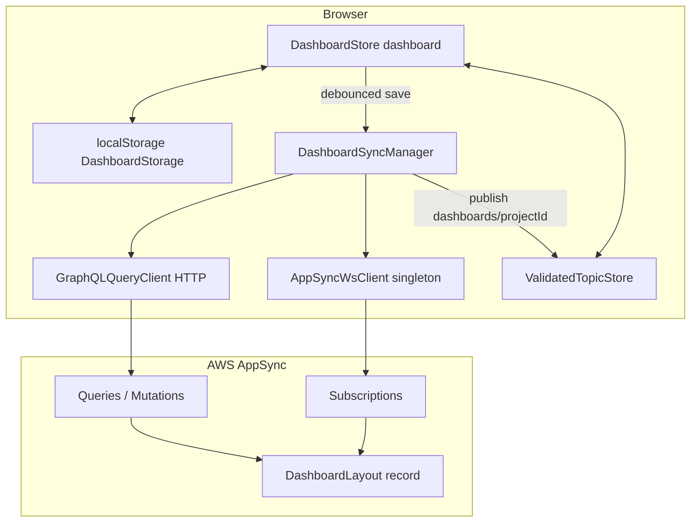

# Dashboard data structures, cloud sync, and state management

This document describes how **project dashboard layout** and **widget runtime data** are modeled, persisted locally, synchronized with **AWS AppSync**, and wired to **GraphQL** and **realtime subscriptions** in **uw-webapp**.

For the shared WebSocket stack and how subscriptions feed `ValidatedTopicStore`, see [AppSync-realtime-and-ValidatedTopicStore.md](./AppSync-realtime-and-ValidatedTopicStore.md). For the topic store API in depth, see [validated-topic-store.md](./validated-topic-store.md).

---

## Table of contents

1. [Conceptual layers](#1-conceptual-layers)
2. [Client-side layout model](#2-client-side-layout-model)
3. [Cloud model: `DashboardLayout`](#3-cloud-model-dashboardlayout)
4. [GraphQL operations](#4-graphql-operations)
5. [Local persistence and versioning](#5-local-persistence-and-versioning)
6. [`DashboardStore` (singleton `dashboard`)](#6-dashboardstore-singleton-dashboard)
7. [`DashboardSyncManager` and `BaseSyncManager`](#7-dashboardsyncmanager-and-basesyncmanager)
8. [Caching and invalidation](#8-caching-and-invalidation)
9. [`ValidatedTopicStore` and widgets](#9-validatedtopicstore-and-widgets)
10. [Widget prompts (separate from layout)](#10-widget-prompts-separate-from-layout)
11. [Route initialization sequence](#11-route-initialization-sequence)
12. [File index](#12-file-index)

---

## 1. Conceptual layers

| Layer | Responsibility |
|--------|----------------|
| **`DashboardStore`** | Authoritative **in-memory** layout: tabs, widgets, grid config, z-order, drag/resize UI state, undo/redo snapshots, cloud sync status. |
| **`DashboardStorage`** | **localStorage** read/write, format migration (v3/v4 → v5), JSON serialization for cloud, reconciliation helpers. |
| **`DashboardSyncManager`** | One **AppSync `DashboardLayout`** per project: list/create/update over HTTP; create/update subscriptions over WebSocket; publishes layout snapshot to `validatedTopicStore` under `dashboards/{projectId}`. |
| **`ValidatedTopicStore`** | Topic-keyed tree with optional JSON Schema validation; holds **per-widget payload** under `widgets/{type}/{id}` and other app data; **not** the primary source for grid layout (that is `MultiTabDashboardState`). |
| **AppSync** | Persists `DashboardLayout` (parent = project); pushes realtime events on create/update. |

---

## 2. Client-side layout model

Primary types live under `src/lib/dashboard/types/`.

### 2.1 `MultiTabDashboardState`

Defined in [`dashboardTabs.ts`](../src/lib/dashboard/types/dashboardTabs.ts). This is the **canonical blob** stored in localStorage and inside AppSync `DashboardLayout.state` (as JSON).

| Field | Meaning |
|--------|---------|
| `version` | Must match `DASHBOARD_STORAGE_VERSION` (currently **`5.0.0`**) for validation. |
| `activeTabId` | Which tab is selected. |
| `tabOrder` | Ordered list of `{ id, label }` tabs. |
| `tabs` | Map `tabId → TabDashboardSlice`. |
| `cloudLayoutId` | Optional AppSync `DashboardLayout.id`; kept so the client can reconnect subscriptions after refresh. |

### 2.2 `TabDashboardSlice`

Per-tab snapshot:

| Field | Meaning |
|--------|---------|
| `widgets` | `Widget[]` — positions, sizes, types, metadata (`topicOverride`, `promptId`, etc.). |
| `config` | `DashboardConfig` — e.g. `gridColumns`, `gridRows`. |
| `widgetData` | `Record<string, unknown>` — keys are **topic paths** like `widgets/metric/{id}`; values are snapshots restored into / collected from `ValidatedTopicStore`. |

### 2.3 `Widget` and `DashboardConfig`

[`widget.ts`](../src/lib/dashboard/types/widget.ts) defines the **discriminated union** of widget kinds (`WidgetType`, chart types, pro-forma widgets, etc.), shared fields (`BaseWidget`: grid position, span, `locked`, `topicOverride`, `promptId`), and `DashboardConfig` defaults.

Widgets **do not** embed their live topic payloads in the cloud layout blob beyond `widgetData` snapshots; interactive widgets read/write **`ValidatedTopicStore`** at runtime using topics from [`widgetSchemaRegistration`](../src/lib/dashboard/setup/widgetSchemaRegistration.ts).

---

## 3. Cloud model: `DashboardLayout`

The GraphQL type is defined in **`@stratiqai/types-simple`** ([`schema.graphql`](../../stratiqai-types-simple/src/graphql/schema.graphql)):

- **`parentId`**: Project id (one layout entity per project in practice; the client lists with `limit: 1`).
- **`state`**: `AWSJSON` — stringified **`MultiTabDashboardState`**.
- **`version`**: Storage format string (aligned with `DASHBOARD_STORAGE_VERSION` on write).
- Standard **`Node` & `Metadata`**: `id`, `entityType`, `tenantId`, `ownerId`, timestamps, `deletedAt`.

Authorization is Cognito + IAM per schema directives (same groups as other project-scoped entities).

---

## 4. GraphQL operations

All operations are defined in **`stratiqai-types-simple`** and imported as documents / constants in the webapp (e.g. `Q_LIST_DASHBOARD_LAYOUTS`, `M_CREATE_DASHBOARD_LAYOUT`, `M_UPDATE_DASHBOARD_LAYOUT`, `S_ON_CREATE_DASHBOARD_LAYOUT`, `S_ON_UPDATE_DASHBOARD_LAYOUT`).

| Operation | Role |
|-----------|------|
| **`listDashboardLayouts(parentId, limit, nextToken)`** | Loads the project’s layout(s); dashboard code uses **`limit: 1`**. |
| **`getDashboardLayout(key)`** | Available for direct fetch by composite key (manager currently prefers list). |
| **`createDashboardLayout(input)`** | Creates row with `parentId`, `state`, `version`. |
| **`updateDashboardLayout(key, input)`** | Updates `state` / `version` for existing row. |
| **`onCreateDashboardLayout(parentId)`** | Subscription: new layout for project; client sets `layoutId` and applies payload. |
| **`onUpdateDashboardLayout(id)`** | Subscription: remote edits; client merges into localStorage and reloads store. |

Implementation reference: [`DashboardSyncManager.ts`](../src/lib/services/realtime/websocket/sync-managers/DashboardSyncManager.ts).

---

## 5. Local persistence and versioning

[`DashboardStorage`](../src/lib/dashboard/utils/storage.ts) centralizes:

- **Project-scoped keys** — `dashboard_*_project_{projectId}` for workspace JSON.
- **Validation** — `isValidMultiTabState` enforces shape and `version === DASHBOARD_STORAGE_VERSION`.
- **Migration** — Legacy v3 single-dashboard keys and v4 tab sets are upgraded to v5 multi-tab state when loaded.
- **Widget data** — `collectWidgetDataFromStore()` walks `validatedTopicStore.tree.widgets` and builds the `widgetData` map; `restoreWidgetDataSnapshot()` pushes values back into the store when switching tabs or loading.

**Cloud helpers:**

| Method | Behavior |
|--------|----------|
| `parseRemoteLayoutState` | Normalizes AppSync `AWSJSON` (string or object) → `MultiTabDashboardState` or null. |
| `loadFromCloud` | Uses `syncManager.loadLayout()`; returns `layoutId` even if `state` is empty/invalid. |
| `saveToCloud` | `JSON.stringify(state)` + `syncManager.updateLayout(json, DASHBOARD_STORAGE_VERSION)`. |
| `migrateToCloud` | Creates layout if missing, else updates. |
| `reconcileWithCloud` | **v1 policy: cloud wins** when state parses; persists `cloudLayoutId` into saved JSON. |

---

## 6. `DashboardStore` (singleton `dashboard`)

[`dashboard.svelte.ts`](../src/lib/dashboard/stores/dashboard.svelte.ts) is a **Svelte 5 rune-backed** class exported as `dashboard`.

### 6.1 Responsibilities

- **Grid / widgets** — add/remove/move/resize, collision resolution, z-index, fullscreen, multi-tab switch with slice flush/restore.
- **Auto-save** — debounced `save()` (~1s) writes localStorage and schedules cloud save.
- **Cloud** — `setSyncManager`, `cloudSyncStatus`, `syncToCloud()`, `reloadFromCloud()`, reconciliation on `initialize(projectId)`.
- **Undo/redo** — layout-only snapshots (positions/spans), not full topic data history.
- **Echo suppression** — `#lastCloudPushUpdatedAt` compared to incoming `remoteLayout.updatedAt` to ignore subscription echoes from the client’s own mutation.

### 6.2 Cloud reconciliation (on `initialize`)

When a `DashboardSyncManager` is attached and `projectId` is set:

1. Load local snapshot from localStorage (if any).
2. **`#reconcileWithCloud`** — `DashboardStorage.loadFromCloud`:
   - If cloud has valid state → **cloud wins** (merge into store + localStorage).
   - If cloud row exists but state unusable → keep in-memory layout, persist `cloudLayoutId` if known.
   - If no cloud row but local exists → **`migrateToCloud`**.
   - If neither → **`migrateToCloud`** with current default in-memory state so a layout id exists quickly.
3. **`#wireCloudSubscriptions`** — either `setupUpdateSubscription` (if `cloudLayoutId` known) or `setupCreateSubscription` until the first layout exists.

### 6.3 Remote updates

`#handleRemoteUpdate`:

- Skips when `#isReconciling`.
- Skips when `updatedAt` matches `#lastCloudPushUpdatedAt` (own write echo).
- Parses `state`, writes to localStorage, calls `#loadFromSavedState`, emits `dashboard:loaded`.

---

## 7. `DashboardSyncManager` and `BaseSyncManager`

### 7.1 `BaseSyncManager`

[`BaseSyncManager.ts`](../src/lib/services/realtime/websocket/sync-managers/BaseSyncManager.ts) provides:

- **`GraphQLQueryClient`** for HTTP GraphQL (Cognito id token).
- **Singleton `AppSyncWsClient`** via `initAppSyncWsClient` / `getAppSyncWsClient` from [`wsClient.ts`](../src/lib/services/realtime/websocket/wsClient.ts).
- **Lifecycle** — `initialize` / `cleanup`, status (`inactive` → `initializing` → `ready` / `error`), deduped init promise.
- **Reconnect** — `registerOnReconnect` triggers **`doRefetch()`** so HTTP list runs again after WebSocket reconnect (reduces stale layout id / state).

`DashboardSyncManager` implements `doRefetch` by **`loadLayout()`** and publishing to `validatedTopicStore`.

### 7.2 `DashboardSyncManager` specifics

- **Topic:** `dashboards/{projectId}` — each successful load/update/subscription payload is **`publish`**’d with `{ source: 'http' }` on query path and default source on subscription path (see store for `PublishSource`).
- **Subscriptions** use **`SubscriptionSpec`**: `query`, `variables`, `path` (`onUpdateDashboardLayout` / `onCreateDashboardLayout`), `next`, `error`; registered with **`addSubscription`** / **`removeSubscription`** (not raw `subscribe`).

### 7.3 `createInactive` + `initialize` pattern

The dashboard route uses **`DashboardSyncManager.createInactive()`** then **`await syncManager.initialize({ idToken, projectId })`** so construction stays sync and async work happens in one place. On failure, `dashboard.setSyncManager(null)` leaves the UI on local-only mode.

---

## 8. Caching and invalidation

| Mechanism | What is cached | Invalidation |
|-----------|----------------|--------------|
| **localStorage** | Last saved `MultiTabDashboardState` per project | Overwritten on every successful `save()` / cloud merge / `reloadFromCloud`. |
| **`DashboardStore` memory** | Current tab’s widgets, config, UI state | Project switch resets widgets; `reloadFromCloud` clears local keys then loads AppSync. |
| **`ValidatedTopicStore` schema resolution** | Per-topic compiled schema match (see store doc) | Invalidated when schemas are registered or unregistered. |
| **AppSync WebSocket** | Single long-lived connection; subscription specs re-applied after reconnect | Reconnect triggers **`doRefetch`** on managers to refresh HTTP-backed state. |
| **Subscription echo** | N/A | `#lastCloudPushUpdatedAt` + `updatedAt` comparison drops self-echoes. |

There is **no separate HTTP cache** for dashboard layout in the client beyond “whatever `loadLayout` returns”; freshness depends on refetch + subscriptions.

---

## 9. `ValidatedTopicStore` and widgets

- **Layout** (positions, tab structure) lives in **`DashboardStore`** / **`MultiTabDashboardState`**.
- **Widget content** (metrics, tables, AI output shapes, etc.) is published to **topics** such as `widgets/{type}/{widgetId}`, configured in widget setup and the **dashboard-widget-sdk** host adapter in [`Dashboard.svelte`](../src/lib/dashboard/components/Dashboard.svelte) (`setDashboardWidgetHost`).

When persisting a tab, **`widgetData`** captures a snapshot of those topic values for restore. **`clearWidgetTopicsForLayout`** removes store entries when widgets are removed or tabs switch, to avoid orphaned keys.

The SDK receives a **narrowed adapter** over `validatedTopicStore` (tree, `at`, `publish`, `patch`, schema lookups) so package widgets do not depend on Svelte internals directly.

---

## 10. Widget prompts (separate from layout)

Per-widget **AI prompts** (instances, schema definitions, edit/save flows) are handled by [`widgetPromptService.ts`](../src/lib/services/widgetPromptService.ts) and GraphQL types for prompts in **`@stratiqai/types-simple`**. The **`promptId`** field on `Widget` links a widget to its prompt instance. This is **orthogonal** to `DashboardLayout`: layout JSON may store `promptId`, while prompt text and model settings live in their own API entities.

---

## 11. Route initialization sequence

[`+page.svelte`](../src/routes/(app)/p/[projectId]/dashboard/+page.svelte) (simplified):

1. Resize grid columns for viewport.
2. If `projectId` and `idToken`: create **`DashboardSyncManager`**, **`initialize`** with timeout; **`dashboard.setSyncManager`** or `null` on failure.
3. **`dashboard.initialize(projectId)`** — local load + cloud reconciliation.
4. If no saved dashboard: **`publishWidgetData`** + add default widgets from route **`config`**.
5. If saved: **`mergeMissingWidgetsFromConfig`** for configured defaults; **`publishWidgetData`** with `onlyIfMissing`.
6. **`ensureGridCapacity`** and final grid sizing.

---

## 12. File index

| Area | Path |
|------|------|
| Dashboard UI shell | `src/lib/dashboard/components/Dashboard.svelte` |
| Dashboard store | `src/lib/dashboard/stores/dashboard.svelte.ts` |
| localStorage + cloud helpers | `src/lib/dashboard/utils/storage.ts` |
| Tab / multi-tab types | `src/lib/dashboard/types/dashboardTabs.ts` |
| Widget types | `src/lib/dashboard/types/widget.ts` |
| Sync manager | `src/lib/services/realtime/websocket/sync-managers/DashboardSyncManager.ts` |
| Base sync lifecycle | `src/lib/services/realtime/websocket/sync-managers/BaseSyncManager.ts` |
| WebSocket client (singleton) | `src/lib/services/realtime/websocket/wsClient.ts` |
| HTTP GraphQL wrapper | `src/lib/services/realtime/store/GraphQLQueryClient.ts` |
| Validated topic store | `src/lib/stores/validatedTopicStore.svelte.ts` |
| Dashboard route | `src/routes/(app)/p/[projectId]/dashboard/+page.svelte` |
| GraphQL schema + operations | `stratiqai-types-simple/src/graphql/schema.graphql`, `queries|mutations|subscriptions/DashboardLayout.ts` |
| Widget prompts | `src/lib/services/widgetPromptService.ts` |

---

## Related documentation

| Document | Contents |
|----------|----------|
| [AppSync-realtime-and-ValidatedTopicStore.md](./AppSync-realtime-and-ValidatedTopicStore.md) | WS client, `SubscriptionSpec`, reconnect refetch |
| [validated-topic-store.md](./validated-topic-store.md) | Topic patterns, AJV, `onChange`, TopicStoreSync |
