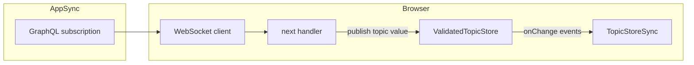

# ValidatedTopicStore

An in-memory, hierarchical state container with MQTT-style topic addressing and JSON Schema validation. Built on Svelte 5 `$state` runes for automatic UI reactivity.

**AppSync WebSocket bridge:** For how GraphQL subscriptions (`AppSyncWsClient`, `appSyncClientStore`) connect to this store, read the canonical guide **[AppSync realtime & ValidatedTopicStore](./AppSync-realtime-and-ValidatedTopicStore.md)**. Section [13](#13-appsync-realtime-and-ontology-integration-planning) below keeps ontology-oriented planning notes and cross-links.

---

## Table of Contents

1. [Overview](#1-overview)
2. [Core Concepts](#2-core-concepts)
3. [API Reference](#3-api-reference)
4. [Schema Registration](#4-schema-registration)
5. [Svelte Hooks](#5-svelte-hooks)
6. [Browser Sync (TopicStoreSync)](#6-browser-sync-topicstoresync)
7. [Stream Catalog Integration](#7-stream-catalog-integration)
8. [Application Startup](#8-application-startup)
9. [Usage Examples](#9-usage-examples)
10. [Architecture](#10-architecture)
11. [File Index](#11-file-index)
12. [Glossary](#12-glossary)
13. [AppSync realtime and ontology integration (planning)](#13-appsync-realtime-and-ontology-integration-planning)

---

## 1. Overview

`ValidatedTopicStore` provides a single reactive state tree where every value is addressed by a slash-separated **topic path** (e.g. `widgets/metric/widget-123`). Data published to a topic is automatically validated against a **JSON Schema** bound to a matching **topic pattern** with MQTT-style wildcards.

The app exposes a **singleton** instance:

```ts
import { validatedTopicStore } from '$lib/stores/validatedTopicStore';
```

Key properties:

- **Schema-first** — all data entering the store passes through AJV validation when a matching schema exists.
- **Reactive** — the internal tree is a Svelte 5 `$state` object; components that read from it re-render automatically.
- **Hierarchical** — topic paths map to nested objects: `widgets/metric/w1` stores at `tree.widgets.metric.w1`.
- **Extensible** — programmatic subscriptions, change listeners, and AI prompt generation from schemas.

---

## 2. Core Concepts

### 2.1 Topic Paths

Topics are slash-separated strings that identify a location in the store tree:

```
widgets/metric/widget-123
app/users/user-42
data/streams/revenue-forecast
```

Paths are **normalized** before use — leading/trailing slashes are removed and empty segments are collapsed.

### 2.2 Wildcard Patterns

Patterns use MQTT-style wildcards for schema binding and subscriptions:

| Token | Meaning | Example |
|-------|---------|---------|
| `+` | Exactly one path segment | `widgets/metric/+` matches `widgets/metric/w1` but not `widgets/metric/w1/out` |
| `#` | Zero or more trailing segments | `app/#` matches `app/users` and `app/users/admin/details` |

Patterns are compiled to anchored regexes internally. `+` becomes `[^/]+`; `#` becomes `.*`.

### 2.3 Specificity-Based Schema Resolution

When multiple schema patterns match a topic, the **most specific** pattern wins. Specificity is scored per segment:

| Segment Type | Score | Example |
|-------------|-------|---------|
| Exact | 10 | `users` |
| `+` (single wildcard) | 5 | `+` |
| `#` (multi wildcard) | 1 | `#` |

For topic `app/users/admin`:
- Pattern `app/#` scores 11 (10 + 1)
- Pattern `app/users/+` scores 25 (10 + 10 + 5)
- Pattern `app/users/admin` scores 30 (10 + 10 + 10) — **wins**

Resolution results are **cached per topic** and invalidated when schemas change.

### 2.4 Validation Behavior

| Condition | Result |
|-----------|--------|
| Schema matches, validation passes | Value stored, errors cleared, `onChange` fires `publish` |
| Schema matches, validation fails | Value **rejected**, errors stored in reactive map, `publish()` returns `false` |
| No schema matches | Value stored without validation (permissive default) |

The AJV instance is configured with `allErrors`, `useDefaults`, `coerceTypes`, and `strict: false`.

### 2.5 StoreChangeEvent

Every mutation emits a `StoreChangeEvent` through `onChange()` listeners:

```ts
type StoreChangeEvent =
  | { type: 'publish'; topic: string; value: unknown }
  | { type: 'delete'; topic: string }
  | { type: 'clear'; path: string }
  | { type: 'register-schema'; registration: SchemaRegistration };
```

This event stream drives the sync layer, dashboard persistence, and any external integrations.

---

## 3. API Reference

### Constructor

```ts
const store = new ValidatedTopicStore();
```

Creates a new empty store. In practice, use the exported singleton `validatedTopicStore`.

### `publish<T>(topic: string, value: T): boolean`

Validates `value` against the best-matching schema for `topic`, then stores it in the tree if valid.

- Returns `true` if the value was stored (valid or no schema).
- Returns `false` if validation failed (value is NOT stored; errors are recorded).
- Notifies programmatic subscribers and emits a `publish` change event on success.

```ts
const ok = store.publish('widgets/metric/w1', { label: 'Revenue', value: 42000 });
if (!ok) {
  console.log('Validation failed:', store.errors.get('widgets/metric/w1'));
}
```

### `at<T>(topic: string): T | undefined`

Reads the value stored at a topic path. Returns `undefined` if the path does not exist. Uses safe navigation — never throws.

```ts
const data = store.at<MetricData>('widgets/metric/w1');
```

### `delete(topic: string): void`

Removes the leaf value at the topic path and clears any associated validation errors. Emits a `delete` change event.

```ts
store.delete('widgets/metric/w1');
```

### `clearAllAt(path: string, options?: { exclude?: string[] }): void`

Deletes all children at the given path. Notifies subscribers for each deleted topic with `undefined`. Emits a single `clear` change event.

```ts
store.clearAllAt('widgets/metric');
store.clearAllAt('widgets', { exclude: ['_metadata'] });
```

### `getAllAt<T>(path: string, options?): Array<{ id: string; data: T }>`

Returns all child entries at a path as `{ id, data }` pairs.

Options:
- `exclude?: string[]` — keys to skip.
- `filter?: (key: string, value: any) => boolean` — custom predicate.
- `includePrimitives?: boolean` — include non-object values (default `false`).

```ts
const widgets = store.getAllAt<MetricData>('widgets/metric');
// [{ id: 'w1', data: { label: 'Revenue', value: 42000 } }, ...]
```

### `getAllAtArray<T>(path: string, options?): T[]`

Same as `getAllAt` but returns only the data values (no IDs).

### `getAllAtMap<T>(path: string, options?): Map<string, T>`

Same as `getAllAt` but returns a `Map<id, data>`.

### `registerSchema(registration: SchemaRegistration): void`

Registers a schema with full metadata. If `topicPattern` is present, compiles an AJV validator for publish-time validation. Always adds to the ID catalog.

```ts
store.registerSchema({
  id: 'widget:metric-v1',
  name: 'Metric Widget',
  description: 'Data schema for metric widgets',
  source: 'code',
  topicPattern: 'widgets/metric/+',
  jsonSchema: { type: 'object', properties: { label: { type: 'string' } }, required: ['label'] }
});
```

### `registerSchema(pattern: string, schema: Schema): void`

Legacy two-argument form. Compiles an AJV validator for the pattern but does **not** create an ID catalog entry. Prefer the object form.

```ts
store.registerSchema('app/users/+', userJsonSchema);
```

### `subscribe<T>(pattern: string, callback: (value: T, topic: string) => void): () => void`

Registers a programmatic subscriber for topics matching the pattern. The callback fires on `publish()`. Returns an unsubscribe function.

```ts
const unsub = store.subscribe('widgets/metric/+', (data, topic) => {
  console.log(`${topic} updated:`, data);
});

// Later:
unsub();
```

### `onChange(listener: (event: StoreChangeEvent) => void): () => void`

Registers a change listener that fires on every successful mutation. Used by sync layers and persistence adapters. Returns an unsubscribe function.

```ts
const unsub = store.onChange((event) => {
  if (event.type === 'publish') {
    console.log('Published:', event.topic, event.value);
  }
});
```

### `getSchemaById(id: string): SchemaRegistration | undefined`

Looks up a schema registration by its unique ID.

### `getJsonSchemaById(id: string): JsonSchemaDefinition | undefined`

Returns just the JSON Schema definition for a given schema ID.

### `getSchemaForTopic(topic: string): SchemaRegistration | undefined`

Resolves the best-matching schema registration for a topic. Returns `undefined` if the match was registered via the legacy two-argument form (no catalog entry).

### `getAllSchemaDefinitions(): SchemaRegistration[]`

Returns all registered `SchemaRegistration` objects from the ID catalog.

### `getRegisteredSchemas(): Array<{ pattern: string; schema: Schema; id?: string }>`

Returns all pattern-bound schemas with their compiled raw schemas and optional IDs.

### `getAISchemaPrompt(topic: string): string`

Generates a structured prompt for AI systems to produce data conforming to the topic's schema. Includes the full JSON Schema as constraints and special handling for `reasoning` fields.

### Reactive Getters

| Getter | Type | Description |
|--------|------|-------------|
| `tree` | `Record<string, any>` | Reactive root of the data tree. Read from Svelte components for automatic updates. |
| `errors` | `Map<string, any>` | Reactive map of validation errors keyed by topic. |
| `schemaVersion` | `number` | Reactive counter incremented on every schema registration. Watch to detect schema changes. |

### `toJSON(): object`

Returns a deep clone of the tree for debugging or serialization.

---

## 4. Schema Registration

### 4.1 SchemaRegistration Interface

```ts
interface SchemaRegistration {
  id: string;              // Unique identifier (e.g. 'widget:metric-v1')
  name: string;            // Human-readable name
  description?: string;    // Optional description
  source?: 'ui' | 'code' | 'ai';  // Who created this schema
  topicPattern?: string;   // MQTT-style pattern for publish validation
  jsonSchema: JsonSchemaDefinition;  // JSON Schema Draft 07
}
```

- **With `topicPattern`**: the schema is compiled with AJV and used to validate `publish()` calls to matching topics.
- **Without `topicPattern`**: the schema is catalog-only — queryable by ID but does not validate publishes.

### 4.2 Source Types

| Source | Meaning | Persistence |
|--------|---------|-------------|
| `'code'` | Defined in the application bundle (widget schemas, built-in types) | Not persisted by sync — shipped with the app |
| `'ui'` | Created by the user through the UI (schema builder, stream creation) | Persisted to `localStorage` and broadcast to other tabs |
| `'ai'` | Generated by AI | Treated like `'ui'` for persistence |

### 4.3 Built-in Widget Schemas

`initializeWidgetSchemas()` (in `src/lib/dashboard/setup/widgetSchemaRegistration.ts`) registers schemas for all built-in widget types:

- Pattern: `widgets/{widgetType}/+` (e.g. `widgets/metric/+`)
- ID: `widget:{widgetType}-v1` (e.g. `widget:metric-v1`)
- Source: `'code'`
- JSON Schema: derived from Zod schemas via `zod-to-json-schema`

Package widgets (from the monorepo `packages/` directory) are also registered with their manifest's `schemaVersion`.

### 4.4 Widget Topic Naming Convention

```
widgets/{widgetType}/{widgetId}
```

Helper: `getWidgetTopic(widgetType, widgetId)` in `widgetSchemaRegistration.ts`.

---

## 5. Svelte Hooks

Module: `src/lib/hooks/validatedTopicStoreRunes.svelte.ts`

All hooks use the singleton `validatedTopicStore` internally.

### `useValidatedTopic<T>(topic: string)` — Read Only

Returns a reactive object with a `current` getter that tracks the value at the given topic.

```svelte
<script lang="ts">
  import { useValidatedTopic } from '$lib/hooks/validatedTopicStoreRunes.svelte';

  const stream = useValidatedTopic<MetricData>('widgets/metric/w1');
  let data = $derived(stream.current ?? defaultData);
</script>
```

### `useReactiveValidatedTopic<T>(topic: () => string)` — Read Only, Dynamic Topic

Like `useValidatedTopic`, but accepts a function that returns the topic. Re-reads automatically when the topic changes (e.g. when a widget ID prop changes).

```svelte
<script lang="ts">
  import { useReactiveValidatedTopic } from '$lib/hooks/validatedTopicStoreRunes.svelte';

  let { widgetId } = $props();
  const topic = $derived(`widgets/metric/${widgetId}`);
  const stream = useReactiveValidatedTopic<MetricData>(() => topic);
</script>
```

### `useValidatedPublisher(topic: string)` — Write Only

Returns `publish(data)` and `clear()` methods for writing to a fixed topic.

```svelte
<script lang="ts">
  import { useValidatedPublisher } from '$lib/hooks/validatedTopicStoreRunes.svelte';

  const publisher = useValidatedPublisher('widgets/metric/w1');

  function update(value: number) {
    publisher.publish({ label: 'Sales', value, unit: '$' });
  }
</script>
```

### `useValidatedSync<T>(topic: string, debounceMs?: number)` — Bidirectional

Provides a reactive `current` getter/setter with echo cancellation and debounced publishing. Designed for forms and editors.

- Remote store changes update `current` immediately (deep-cloned to prevent reference sharing).
- Local changes to `current` are published back after `debounceMs` (default 200ms).
- Echo cancellation prevents remote → local → remote loops.

```svelte
<script lang="ts">
  import { useValidatedSync } from '$lib/hooks/validatedTopicStoreRunes.svelte';

  const sync = useValidatedSync<FormData>('widgets/form/my-form');
</script>

<input bind:value={sync.current.name} />
```

### `useValidatedErrors(topic: string)` — Read Only

Returns reactive validation errors for a topic.

```svelte
<script lang="ts">
  import { useValidatedErrors } from '$lib/hooks/validatedTopicStoreRunes.svelte';

  const { errors } = useValidatedErrors('widgets/metric/w1');
</script>

{#if errors}
  <div class="error">Validation failed: {JSON.stringify(errors)}</div>
{/if}
```

### `useValidatedCollection<T>(basePath: string)` — Read Only

Returns all children at a path as a reactive array of `{ id, data }` entries. Useful for rendering lists of widgets or items.

```svelte
<script lang="ts">
  import { useValidatedCollection } from '$lib/hooks/validatedTopicStoreRunes.svelte';

  const metrics = useValidatedCollection<MetricData>('widgets/metric');
</script>

{#each metrics.items as { id, data }}
  <MetricWidget {id} {data} />
{/each}
```

---

## 6. Browser Sync (TopicStoreSync)

Module: `src/lib/stores/topicStoreSync.ts`

`initTopicStoreSync(store)` wires up cross-tab synchronization and `localStorage` persistence for the store. Returns a cleanup function.

### 6.1 BroadcastChannel

Channel name: `vts-sync` (same-origin tabs only).

Each tab generates a `sender` UUID. Incoming messages from the same sender are ignored (echo suppression). A re-entrancy guard (`isSyncing`) prevents the local `onChange` handler from re-broadcasting while applying a remote message.

### 6.2 Message Types

| `kind` | Payload | Local Handling |
|--------|---------|----------------|
| `publish` | `topic`, `value` | `store.publish(topic, value)` — warns if rejected |
| `delete` | `topic` | `store.delete(topic)` |
| `clear` | `path` | `store.clearAllAt(path)` |
| `register-schema` | `registration` | `store.registerSchema(registration)`; persists UI schemas |

### 6.3 localStorage Keys

| Key | Content |
|-----|---------|
| `vts:data` | Flat JSON map of `{ [topic]: value }` for every published topic |
| `vts:schemas` | JSON array of `SchemaRegistration` objects with `source === 'ui'` only |

### 6.4 Persistence Timing

- **Debounced** writes to `vts:data` after 500ms.
- **`beforeunload`** flushes immediately so fast reloads don't lose edits.
- **Cleanup** flushes once more.

### 6.5 Restore Order

On `initTopicStoreSync`:

1. Restore UI schemas from `vts:schemas`.
2. Restore topic data from `vts:data` — each entry is re-published through `store.publish()`, so validation applies. Failures are logged and skipped.

---

## 7. Stream Catalog Integration

Module: `src/lib/stores/streamCatalog.svelte.ts`

The `StreamCatalog` manages named "data streams" that bind a topic to a schema. When a stream is added, it registers the associated schema as a topic pattern in ValidatedTopicStore.

```ts
interface DataStream {
  id: string;
  topic: string;           // e.g. 'streams/revenue-forecast'
  schemaId: string;        // references a SchemaRegistration.id
  title: string;
  description?: string;
  promptId?: string;       // optional link to AI prompt
  source: 'prompt' | 'manual' | 'code';
  createdAt: string;
  updatedAt: string;
}
```

The catalog has its own `localStorage` persistence (`stream-catalog`) and `BroadcastChannel` (`stream-catalog-sync`) for cross-tab sync, separate from the store's sync layer.

---

## 8. Application Startup

Root layout: `src/routes/+layout.svelte`

In the browser, synchronously during layout initialization (not deferred to `onMount`):

1. **Register package widgets** — `registerWidget(metricWidget)`, etc.
2. **Initialize widget schemas** — `initializeWidgetSchemas()` registers code-defined schemas.
3. **Start topic sync** — `initTopicStoreSync(validatedTopicStore)` restores persisted data and opens the BroadcastChannel.
4. **Initialize stream catalog** — `streamCatalog.init()` restores streams and re-registers their schemas.
5. **Wire dashboard persistence** — `validatedTopicStore.onChange(...)` triggers `DashboardStorage.autoSaveWidgetData()` for widget topic changes.

This ordering ensures child routes (e.g. the dashboard page) find restored topic data already in the store when their `onMount` runs.

**Cleanup** (`onDestroy`): calls the sync cleanup function, unsubscribes the dashboard listener, and destroys the stream catalog.

---

## 9. Usage Examples

### Publishing Data to a Widget Topic

```ts
import { validatedTopicStore } from '$lib/stores/validatedTopicStore';

const topic = 'widgets/metric/revenue-widget';
const ok = validatedTopicStore.publish(topic, {
  label: 'Annual Revenue',
  value: 4200000,
  unit: '$',
  trend: 'up'
});

if (!ok) {
  const errors = validatedTopicStore.errors.get(topic);
  console.error('Invalid data:', errors);
}
```

### Reading Data in a Svelte Component

```svelte
<script lang="ts">
  import { useValidatedTopic } from '$lib/hooks/validatedTopicStoreRunes.svelte';

  const stream = useValidatedTopic<{ label: string; value: number }>('widgets/metric/revenue-widget');
</script>

{#if stream.current}
  <h2>{stream.current.label}</h2>
  <p>{stream.current.value}</p>
{:else}
  <p>No data yet</p>
{/if}
```

### Registering a Custom Schema at Runtime

```ts
validatedTopicStore.registerSchema({
  id: 'custom:market-data-v1',
  name: 'Market Data',
  description: 'Schema for market analysis data points',
  source: 'ui',
  topicPattern: 'data/market/+',
  jsonSchema: {
    type: 'object',
    properties: {
      market: { type: 'string' },
      population: { type: 'number', minimum: 0 },
      medianIncome: { type: 'number', minimum: 0 },
      growthRate: { type: 'number' }
    },
    required: ['market', 'population']
  }
});
```

### Listening to Changes for Side Effects

```ts
const unsub = validatedTopicStore.onChange((event) => {
  switch (event.type) {
    case 'publish':
      analyticsTrack('topic_publish', { topic: event.topic });
      break;
    case 'delete':
      analyticsTrack('topic_delete', { topic: event.topic });
      break;
    case 'clear':
      analyticsTrack('topic_clear', { path: event.path });
      break;
  }
});
```

### Using the AI Prompt Generator

```ts
const prompt = validatedTopicStore.getAISchemaPrompt('widgets/metric/w1');
// Returns a structured prompt with the full JSON Schema as constraints,
// ready to send to an LLM for data generation.
```

---

## 10. Architecture

### 10.1 Internal Data Structures

| Structure | Type | Purpose |
|-----------|------|---------|
| `#tree` | `$state<Record<string, any>>` | Reactive hierarchical data tree |
| `#errors` | `$state<SvelteMap<string, any>>` | Reactive validation errors by topic |
| `#schemas` | `SvelteMap<string, SchemaEntry>` | Pattern → compiled validator, regex, specificity |
| `#schemasById` | `Map<string, SchemaRegistration>` | ID catalog of all registrations |
| `#patternToRegistration` | `Map<string, SchemaRegistration>` | Reverse map from pattern to registration |
| `#resolutionCache` | `Map<string, SchemaEntry \| null>` | Cached best-match results per topic |
| `#subscribers` | `Set<{ pattern, regex, callback }>` | Programmatic subscriptions |
| `#changeListeners` | `Set<(event) => void>` | External change listeners |
| `#schemaVersion` | `$state(number)` | Reactive counter for schema changes |

### 10.2 Data Flow

```
Schema Registration          Publish
       │                        │
       ▼                        ▼
  Compile AJV            Resolve best schema
  validator              (cached lookup)
       │                        │
       ▼                        ▼
  Store in #schemas       Validate with AJV
  Bump schemaVersion           │
  Clear cache            ┌─────┴─────┐
                         │           │
                       Valid      Invalid
                         │           │
                         ▼           ▼
                    Store in      Store in
                     #tree        #errors
                         │        Return false
                         ▼
                  Notify subscribers
                  Emit onChange event
                  Return true
```

### 10.3 Persistence Layers

The store itself is ephemeral (in-memory). Two persistence mechanisms operate on top:

1. **TopicStoreSync** — persists all topic data to `vts:data` and UI schemas to `vts:schemas` in `localStorage`. Cross-tab sync via BroadcastChannel.

2. **DashboardStorage** — persists a project-scoped snapshot of widget topic data into dashboard workspace `localStorage` keys. This is a secondary layer specific to dashboard state management.

### 10.4 Structural Typing for Decoupling

Several modules (GraphQL sync managers, entity publishers) define local `IValidatedTopicStore` interfaces to depend on the store's shape without importing the module directly. This prevents circular dependencies and allows testing with mock stores.

---

## 11. File Index

| Concern | Path |
|---------|------|
| Store implementation | `src/lib/stores/validatedTopicStore.svelte.ts` |
| Barrel re-exports | `src/lib/stores/validatedTopicStore.ts` |
| Svelte hooks | `src/lib/hooks/validatedTopicStoreRunes.svelte.ts` |
| Browser sync | `src/lib/stores/topicStoreSync.ts` |
| Stream catalog | `src/lib/stores/streamCatalog.svelte.ts` |
| Widget schema registration | `src/lib/dashboard/setup/widgetSchemaRegistration.ts` |
| App entry (startup order) | `src/routes/+layout.svelte` |
| Dashboard storage | `src/lib/dashboard/utils/storage.ts` |
| Widget publish helpers | `src/lib/dashboard/utils/widgetPublisher.ts` |
| Widget data publishers | `src/lib/dashboard/setup/widgetDataPublishers.ts` |
| Package widget SDK hooks | `packages/dashboard-widget-sdk/src/lib/hooks.svelte.ts` |
| Type definitions | `src/lib/types/models.ts` (`JsonSchemaDefinition`) |
| Debug sidebar | `src/lib/dashboard/components/ValidatedTopicStoreSidebar.svelte` |
| AppSync + VTS (canonical) | `docs/AppSync-realtime-and-ValidatedTopicStore.md` |
| AppSync client store (stub) | `docs/application_stores/appSyncClientStore.md` |
| AppSync WS client (store path) | `src/lib/services/realtime/websocket/AppSyncWsClient.ts` |
| AppSync WS client (sync managers) | `src/lib/services/realtime/websocket/wsClient.ts` |
| Subscription spec types | `src/lib/services/realtime/websocket/types.ts` |

---

## 12. Glossary

| Term | Meaning |
|------|---------|
| **Topic** | Slash-separated path string; key for a value in the store (e.g. `widgets/metric/w1`) |
| **Pattern** | Topic template with `+` / `#` wildcards for schema binding and subscriptions |
| **Publish** | Validate (if schema matches) → store value → emit `onChange` |
| **SchemaRegistration** | Full metadata object with ID, name, optional topic pattern, and JSON Schema |
| **SchemaEntry** | Internal compiled form: AJV validator function, regex, specificity score, raw schema |
| **Specificity** | Numeric score determining which schema wins when multiple patterns match a topic |
| **TopicStoreSync** | BroadcastChannel + `localStorage` adapter for cross-tab sync and persistence |
| **StreamCatalog** | Named data streams that bind topics to schemas with optional prompt linkage |
| **StoreChangeEvent** | Union type emitted on every store mutation (`publish`, `delete`, `clear`, `register-schema`) |
| **vts:data** | `localStorage` key storing the flat topic → value snapshot |
| **vts:schemas** | `localStorage` key storing UI-created schema registrations |

---

## 13. AppSync realtime and ontology integration (planning)

**Start here for architecture:** [AppSync realtime & ValidatedTopicStore](./AppSync-realtime-and-ValidatedTopicStore.md) — two WebSocket client implementations, `appSyncClientStore`, `SubscriptionSpec`, and the bridge to `validatedTopicStore.publish()`.

This section ties **ValidatedTopicStore** to the **AppSync WebSocket** stack so you can plan wiring the ontology API (`onInstanceUpdated`, `saveEntityInstance`, etc.) into the same reactive model used for workflows and dashboards.

### 13.1 How realtime fits today

**ValidatedTopicStore** is not a WebSocket client. It is the **in-memory, validated sink** that UI and sync code write to with `publish()`. Realtime arrives through a separate layer:

1. A GraphQL **subscription** runs over an AppSync WebSocket connection.
2. The subscription’s `next` handler receives payloads (e.g. an `EntityInstance`).
3. The handler **maps** that payload to a topic path and calls `validatedTopicStore.publish(topic, value)`.
4. If a JSON Schema is registered for a matching topic pattern, **AJV** validates before the value is stored; otherwise the value is accepted as-is.
5. **`onChange`** fires (`StoreChangeEvent`), which drives **TopicStoreSync** (cross-tab + `localStorage`) and any other listeners (e.g. dashboard autosave for `widgets/` topics in [`+layout.svelte`](../src/routes/+layout.svelte)).



**Prior art:** [`WorkflowSyncManager`](../src/lib/services/realtime/websocket/sync-managers/WorkflowSyncManager.ts) combines `GraphQLQueryClient` (HTTP), `AppSyncWsClient` from [`wsClient.ts`](../src/lib/services/realtime/websocket/wsClient.ts), and [`EntitySyncManager`](../src/lib/services/realtime/store/EntitySyncManager.ts) to list/get entities and mirror mutations into `validatedTopicStore` via configured topic paths (`toTopicPath`, entity type keys). Use the same idea for ontology instances, or a thinner helper that only subscribes and publishes.

### 13.2 Two WebSocket entry points in this repo

Both speak the AppSync realtime protocol, but **different modules** import different classes:

| Entry | Module | Typical consumers |
|-------|--------|-------------------|
| **Shared store API** | [`appSyncClientStore`](../src/lib/stores/appSyncClientStore.ts) → `AppSyncWsClient` from [`AppSyncWsClient.ts`](../src/lib/services/realtime/websocket/AppSyncWsClient.ts) | Pages and stores that call `ensureConnection` / `addSubscription` / `removeSubscription` |
| **Direct client** | [`wsClient.ts`](../src/lib/services/realtime/websocket/wsClient.ts) (`getAppSyncWsClient`, `initAppSyncWsClient`) | [`WorkflowSyncManager`](../src/lib/services/realtime/websocket/sync-managers/WorkflowSyncManager.ts), [`DashboardSyncManager`](../src/lib/services/realtime/websocket/sync-managers/DashboardSyncManager.ts), [`DocumentEntitiesSyncManager`](../src/lib/services/realtime/websocket/sync-managers/DocumentEntitiesSyncManager.ts) |

For **new ontology UI**, prefer **one** connection strategy per session: either extend the pattern used by your feature (store vs sync manager) or consolidate later. Avoid opening duplicate WebSockets for the same user and endpoint.

> **Doc note:** Full API for the shared store, both `AppSyncWsClient` implementations, and `SubscriptionSpec` is in [AppSync realtime & ValidatedTopicStore](./AppSync-realtime-and-ValidatedTopicStore.md). Types: [`SubscriptionSpec`](../src/lib/services/realtime/websocket/types.ts).

### 13.3 Ontology subscription: `onInstanceUpdated`

Backend contract (AppSync):

- Subscription: `onInstanceUpdated(projectId: ID!, id: ID!)` filtered on the **mutation result** for `saveEntityInstance`.
- The mutation resolver must return **`projectId` and `id`** (GraphQL-facing IDs, not raw `PROJ#` / `INST#` prefixes) so clients subscribing with the same variables receive events.

Client checklist:

1. Add the subscription document to **`@stratiqai/types-simple`** (project convention), run types/codegen as usual.
2. Subscribe with `variables: { projectId, id }` matching the instance you care about (or use multiple specs / a small manager if you need many instances).
3. In `next`, normalize the `EntityInstance` if needed, choose a **topic** (see below), then `validatedTopicStore.publish(topic, payload)`.

### 13.4 Topic and schema conventions for ontology

Pick a stable namespace so ontology data does not collide with existing trees (`widgets/`, `workflowExecutions/`, etc.):

- **Per-instance topic (explicit):**  
  `ontology/projects/{projectId}/instances/{instanceId}`  
  Value: full or partial `EntityInstance` (or a UI-specific projection).
- **Pattern for schemas:**  
  e.g. `ontology/projects/+/instances/+` so one JSON Schema applies to all instances under a project, or finer patterns if you need per-definition shapes.

Register schemas with `registerSchema({ id, name, topicPattern, jsonSchema, ... })` **before** relying on validation; mirror the structure you put in `publish()`.

If validation fails, `publish()` returns **`false`** and errors appear in `validatedTopicStore.errors` — shape subscription payloads to match the registered schema or skip validation for that topic (no matching pattern).

### 13.5 Queries and mutations vs the store

Realtime updates only reflect **future** `saveEntityInstance` calls. Plan also:

- **Initial load:** `listEntityDefinitions` / `getEntityInstance` (HTTP via your existing GraphQL client, e.g. [`GraphQLQueryClient`](../src/lib/services/realtime/store/GraphQLQueryClient.ts)) to seed `validatedTopicStore` or a dedicated Svelte store.
- **Writes:** mutation from the UI, then either rely on the subscription to update the store or apply an optimistic `publish()` and reconcile on error.

### 13.6 Related documentation

- [AppSync realtime & ValidatedTopicStore](./AppSync-realtime-and-ValidatedTopicStore.md) — `AppSyncWsClient`, `appSyncClientStore`, `SubscriptionSpec`, bridge to this store
- Platform ontology architecture: stratiqai-platform `environments/docs-src/internal/architecture/ontology-graph.md` (DynamoDB + resolvers).
- Types package: `stratiqai-types-simple` ontology GraphQL files and schema fingerprinting docs under `docs/ontology/`.
